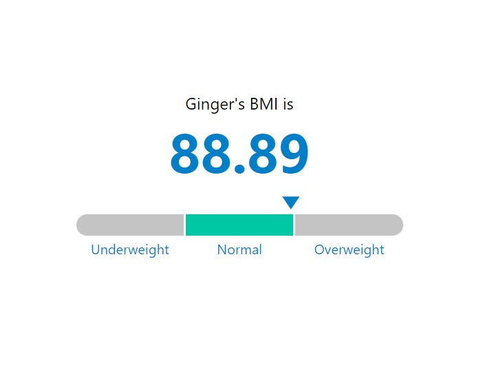

# Score Visualization

## About

A "Score Visualization" is a simple widget needing only the name, and the BMI score of the animal which is between 0 and 120, and will nicely visualize the BMI score according to this calculation:
- if the BMI score less than 30 it will be underweight and the yellow color represents it with an indicator showing the percentage on the bar.

- if the BMI score is between 30 and 90 it will be normal and the green color represents it with an indicator showing the percentage on the bar.
  
- if the BMI score is bigger than 90 it will be overweight and the orange color represents it with an indicator showing the percentage on the bar.


  
This application was built with React.
## Built With

- HTML, CSS, TypeScript.
- React.
- VisualStudio Code, Git, & GitHub.
## Pre-requisites

- NodeJs
- Git
## Getting Started

To run this project, you only need a computer with a browser installed, and follow these steps:


1. In your terminal, in the folder of your preference, type the following bash command to clone this repository:

```sh
git clone git@github.com:Maha-Magdy/score-visualization.git
```

2. Now that you have already cloned the repo run the following commands to get the project up and running:
```sh
cd score-visualization
npm install
npm start
```

3. To change the name of the animal, and its BMI score to see the difference in the UI go to 
```sh
src/App.tsx
```
and change the value of the props name, and bmiScore that belong to ScoreVisualization component then save.

## Author

👤 **Maha Magdy**

- GitHub: [Maha-Magdy](https://github.com/Maha-Magdy)
- Twitter: [@Maha_M_Abdelaal](https://twitter.com/Maha_M_Abdelaal)
- LinkedIn: [Maha Magdy](https://www.linkedin.com/in/maha-magdy-abdelaal/)

## 🤝 Contributing

Contributions, issues, and feature requests are welcome!

Feel free to check the [issues page](https://github.com/Maha-Magdy/score-visualization/issues).

## Show your support

Give a ⭐️ if you like this project!

## 📝 License

This project is [MIT](./LICENSE) licensed.
